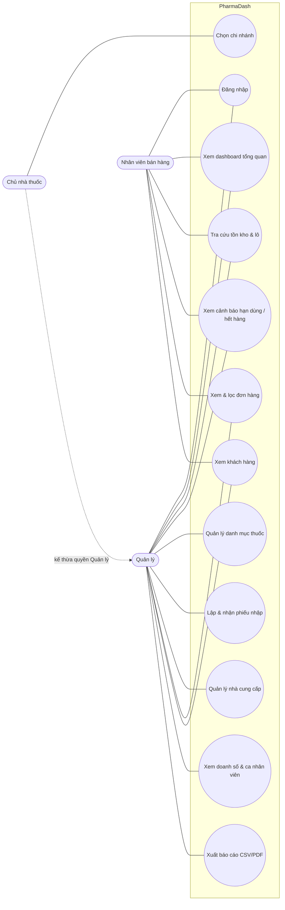

# 1. Đặc tả yêu cầu phần mềm (SRS rút gọn)

**Dự án:** PharmaDash – Hệ thống Dashboard điều hành nhà thuốc
**Phiên bản tài liệu:** 1.0 · **Ngày:** 28/09/2026

## 1.1 Mục đích và phạm vi

Hệ thống giúp **chủ nhà thuốc** và **quản lý chi nhánh** theo dõi hoạt động kinh doanh theo thời gian thực trên một màn hình duy nhất: doanh thu, lợi nhuận, đơn hàng, tồn kho theo lô, hạn dùng, nhập hàng, khách hàng và hiệu quả nhân viên. **Nhân viên bán hàng** dùng hệ thống với quyền hạn chế để tra cứu tồn kho và theo dõi doanh số cá nhân.

**Trong phạm vi:** dashboard tổng quan, quản lý tồn kho, xem/lọc đơn hàng, nhập hàng và nhà cung cấp, khách hàng, nhân viên và ca làm, báo cáo CSV/PDF, phân quyền 3 vai trò.
**Ngoài phạm vi:** màn hình bán hàng (POS), thanh toán trực tuyến, kết nối cổng dược quốc gia, triển khai thật. Dữ liệu là giả lập.

## 1.2 Tác nhân (Actor)

| Tác nhân | Mô tả | Phạm vi dữ liệu |
|---|---|---|
| Chủ nhà thuốc (Owner) | Người sở hữu chuỗi, ra quyết định kinh doanh | Mọi chi nhánh, xem được lợi nhuận và giá nhập |
| Quản lý (Manager) | Phụ trách 1 chi nhánh | Chi nhánh của mình |
| Nhân viên bán hàng (Staff) | Dược sĩ / nhân viên quầy | Doanh số và đơn của chính mình; không thấy giá nhập hay lợi nhuận |
| Hệ thống (System) | Tác vụ tự động | Bù dữ liệu, mô phỏng đơn realtime |

## 1.3 User story

| ID | Là… | Tôi muốn… | Để… | Ưu tiên |
|---|---|---|---|---|
| US01 | Chủ nhà thuốc | xem doanh thu, số đơn, lợi nhuận hôm nay/7 ngày/30 ngày kèm % so với kỳ trước | nắm nhanh tình hình kinh doanh | Must |
| US02 | Chủ nhà thuốc | xem biểu đồ doanh thu theo giờ/ngày/tháng | nhận ra xu hướng và mùa vụ | Must |
| US03 | Chủ nhà thuốc | chuyển giữa "tất cả chi nhánh" và từng chi nhánh | so sánh hiệu quả các chi nhánh | Must |
| US04 | Quản lý | thấy danh sách thuốc sắp hết hạn trong 30/60/90 ngày | xử lý trả hàng / khuyến mãi kịp thời | Must |
| US05 | Quản lý | thấy thuốc dưới mức tồn tối thiểu và đặt hàng ngay | không bị hết hàng | Must |
| US06 | Quản lý | tạo phiếu nhập, xác nhận nhận hàng kèm số lô và hạn dùng | tồn kho được cập nhật chính xác theo lô | Must |
| US07 | Quản lý | lọc đơn theo ngày, nhân viên, phương thức thanh toán | đối soát cuối ca / cuối ngày | Must |
| US08 | Chủ nhà thuốc | xuất báo cáo doanh thu, tồn kho ra CSV/PDF | lưu trữ và gửi kế toán | Must |
| US09 | Nhân viên | xem doanh số của mình và tra cứu tồn kho | tư vấn khách và theo dõi chỉ tiêu | Should |
| US10 | Quản lý | xem xếp hạng doanh số và lịch ca nhân viên | đánh giá và phân ca hợp lý | Should |
| US11 | Quản lý | xem lịch sử mua và hạng thành viên của khách | chăm sóc khách thân thiết | Should |
| US12 | Chủ nhà thuốc | xem top thuốc bán chạy, doanh thu theo nhóm thuốc | tối ưu danh mục và nhập hàng | Should |
| US13 | Quản lý | nhập danh mục thuốc từ file CSV | không phải nhập tay nhiều dòng | Could |
| US14 | Người dùng | đổi giao diện sáng/tối, tìm kiếm nhanh Ctrl+K | thao tác thuận tiện | Could |
| US15 | Người trình bày | bật chế độ demo tự sinh đơn | minh họa tính năng realtime | Could |

## 1.4 Sơ đồ use case

## 1.5 Đặc tả các use case chính

### UC2 – Xem dashboard tổng quan
- **Tác nhân:** mọi vai trò · **Tiền điều kiện:** đã đăng nhập
- **Luồng chính:**
  1. Hệ thống hiển thị 4 thẻ KPI theo kỳ mặc định (7 ngày) và phạm vi của người dùng.
  2. Người dùng chọn kỳ (Hôm nay / 7 ngày / 30 ngày), KPI được tính lại và so sánh với kỳ trước cùng độ dài.
  3. Người dùng chọn khoảng thời gian cho biểu đồ doanh thu, di chuột để xem tooltip từng cột.
  4. Dữ liệu tự làm mới mỗi 30 giây; dòng "Cập nhật lần cuối" hiển thị thời gian tương đối.
- **Luồng thay thế:** 2a. Nhân viên thấy "Doanh thu của tôi" và "Khách thành viên" thay cho "Lợi nhuận".
- **Hậu điều kiện:** không thay đổi dữ liệu.

### UC7 – Lập và nhận phiếu nhập
- **Tác nhân:** Quản lý, Chủ · **Tiền điều kiện:** có nhà cung cấp và danh mục thuốc
- **Luồng chính:**
  1. Người dùng bấm "Tạo phiếu nhập", chọn nhà cung cấp, ngày giao, chi nhánh (Chủ) và danh sách thuốc/số lượng/đơn giá.
  2. Bấm "Đặt hàng": phiếu chuyển sang trạng thái *Đã đặt*, xuất hiện trên lịch ngày giao.
  3. Khi hàng về, mở phiếu và bấm "Nhận hàng vào kho", nhập số lô và hạn dùng cho từng dòng.
  4. Hệ thống tạo **lô tồn kho** tương ứng, phiếu chuyển sang *Đã nhập kho*.
- **Luồng thay thế:** 1a. "Lưu nháp" → trạng thái *Nháp*, duyệt sau. 3a. Hạn dùng ≤ hôm nay → báo lỗi, không nhận. 3b. Hủy phiếu → *Đã hủy*.
- **Quy tắc:** chỉ phiếu *Đã đặt* mới được nhận hàng, và mỗi phiếu chỉ nhận một lần.

### UC5 – Xem cảnh báo hạn dùng / hết hàng
- **Luồng chính:** hệ thống liệt kê các lô còn hàng có hạn dùng ≤ 30/60/90 ngày (kể cả đã quá hạn), và các thuốc có tồn < mức tối thiểu theo từng chi nhánh. Người dùng bấm "Đặt hàng" để mở form phiếu nhập đã điền sẵn thuốc.
- **Hiển thị:** badge đỏ (quá hạn / ≤30 ngày / hết hàng), cam (≤60 ngày / sắp hết), xanh (≤90 ngày).

### UC12 – Xuất báo cáo
- **Luồng chính:** chọn khoảng ngày → xem trước số liệu → bấm "Xuất CSV" hoặc "Xuất PDF" → trình duyệt tải file.
- **Yêu cầu:** CSV mở đúng tiếng Việt trong Excel (UTF-8 BOM); PDF nhúng font hỗ trợ tiếng Việt, có số trang.

## 1.6 Yêu cầu phi chức năng

| Mã | Yêu cầu | Cách đáp ứng |
|---|---|---|
| NFR1 | Cài đặt và chạy bằng 1–2 lệnh | `npm install && npm run dev`, SQLite tích hợp sẵn trong Node |
| NFR2 | API dashboard phản hồi < 500 ms với khoảng 32.000 đơn | Chỉ mục SQL, truy vấn gộp |
| NFR3 | Responsive desktop, tablet | Sidebar tự thu thành icon < 1280px, KPI 2x2 |
| NFR4 | Giao diện tiếng Việt, định dạng tiền và ngày kiểu VN | `Intl` vi-VN |
| NFR5 | Bảo mật cơ bản | Mật khẩu băm bcrypt, JWT, kiểm tra quyền ở server |
| NFR6 | Dark / light mode | Design token bằng biến CSS |
| NFR7 | Khả năng tiếp cận | Trạng thái kèm icon/nhãn (không chỉ màu), điều hướng bằng bàn phím, thang màu biểu đồ đã kiểm tra tương phản |
