# 2. Cấu trúc phân rã công việc (WBS) và lịch trình

> Lịch trình **dự kiến** cho nhóm 4–5 người trong 10 tuần (07/09 – 15/11/2026). Nhóm nên điều chỉnh tên người phụ trách và ngày cho khớp thực tế.
> Vai trò: **PM** – quản lý dự án · **BA** – phân tích nghiệp vụ · **BE** – backend · **FE** – frontend · **QA** – kiểm thử.

## 2.1 WBS

```mermaid
flowchart TD
  P[PharmaDash] --> A[1. Khởi động & lập kế hoạch]
  P --> B[2. Phân tích & thiết kế]
  P --> C[3. Phát triển Backend]
  P --> D[4. Phát triển Frontend]
  P --> E[5. Kiểm thử]
  P --> F[6. Tài liệu & bàn giao]

  A --> A1[1.1 Project charter]
  A --> A2[1.2 Kế hoạch & WBS]
  A --> A3[1.3 Quản lý rủi ro]
  B --> B1[2.1 Thu thập yêu cầu / SRS]
  B --> B2[2.2 Thiết kế CSDL - ERD]
  B --> B3[2.3 Thiết kế API]
  B --> B4[2.4 Thiết kế UI / design token]
  C --> C1[3.1 Khung dự án + schema]
  C --> C2[3.2 Seed dữ liệu mẫu]
  C --> C3[3.3 Auth + phân quyền]
  C --> C4[3.4 API nghiệp vụ]
  C --> C5[3.5 Xuất CSV/PDF]
  D --> D1[4.1 Layout: Sidebar, Topbar]
  D --> D2[4.2 Dashboard tổng quan]
  D --> D3[4.3 Kho thuốc]
  D --> D4[4.4 Đơn hàng, Khách hàng]
  D --> D5[4.5 Nhập hàng, Nhân viên, Báo cáo]
  D --> D6[4.6 Dark mode, responsive]
  E --> E1[5.1 Kế hoạch & test case]
  E --> E2[5.2 Kiểm thử chức năng]
  E --> E3[5.3 Kiểm thử phân quyền]
  E --> E4[5.4 Sửa lỗi & hồi quy]
  F --> F1[6.1 README / hướng dẫn]
  F --> F2[6.2 Báo cáo đồ án]
  F --> F3[6.3 Demo trước giảng viên]
```



## 2.2 Bảng công việc

| Mã | Công việc | Phụ trách | Bắt đầu | Kết thúc | Công (ngày) | Phụ thuộc | Sản phẩm bàn giao |
|---|---|---|---|---|---|---|---|
| 1.1 | Project charter | PM | 07/09 | 09/09 | 2 | – | Charter |
| 1.2 | Kế hoạch, WBS, lịch trình | PM | 09/09 | 12/09 | 3 | 1.1 | Tài liệu này |
| 1.3 | Nhận diện rủi ro | PM | 11/09 | 13/09 | 2 | 1.1 | Bảng rủi ro |
| 2.1 | Thu thập yêu cầu, viết SRS | BA | 09/09 | 16/09 | 5 | 1.1 | 01-SRS.md |
| 2.2 | Thiết kế CSDL (ERD) | BE | 14/09 | 18/09 | 4 | 2.1 | 04-ERD |
| 2.3 | Thiết kế danh sách API | BE | 16/09 | 20/09 | 3 | 2.2 | Bảng API |
| 2.4 | Thiết kế UI, design token | FE | 14/09 | 21/09 | 5 | 2.1 | Mockup, tailwind.config |
| 3.1 | Khung dự án, schema SQLite | BE | 21/09 | 23/09 | 2 | 2.2 | server/src/db |
| 3.2 | Seed dữ liệu (thuốc VN, 12 tháng bán hàng) | BE | 23/09 | 28/09 | 4 | 3.1 | seed/ |
| 3.3 | Đăng nhập JWT + phân quyền | BE | 24/09 | 29/09 | 3 | 3.1 | middleware/auth |
| 3.4 | API nghiệp vụ | BE | 28/09 | 12/10 | 10 | 3.2, 3.3 | routes/ |
| 3.5 | Xuất CSV/PDF | BE | 12/10 | 17/10 | 4 | 3.4 | services/reports |
| 4.1 | Layout Sidebar/Topbar | FE | 28/09 | 03/10 | 4 | 2.4 | components/layout |
| 4.2 | Dashboard tổng quan | FE | 03/10 | 14/10 | 7 | 4.1, 3.4 | pages/Dashboard |
| 4.3 | Kho thuốc | FE | 12/10 | 20/10 | 6 | 4.1 | pages/Inventory |
| 4.4 | Đơn hàng, Khách hàng | FE | 17/10 | 26/10 | 6 | 4.1 | pages/Orders, Customers |
| 4.5 | Nhập hàng, Nhân viên, Báo cáo | FE | 24/10 | 03/11 | 7 | 3.5 | pages/… |
| 4.6 | Dark mode, responsive | FE | 01/11 | 05/11 | 3 | 4.2–4.5 | – |
| 5.1 | Kế hoạch & test case | QA | 05/10 | 12/10 | 5 | 2.1 | 05-test-plan.md |
| 5.2 | Kiểm thử chức năng | QA | 27/10 | 06/11 | 8 | 4.4, 5.1 | Báo cáo lỗi |
| 5.3 | Kiểm thử phân quyền | QA | 03/11 | 07/11 | 3 | 3.3, 4.5 | Kết quả test |
| 5.4 | Sửa lỗi, hồi quy | BE+FE | 05/11 | 11/11 | 5 | 5.2 | Bản ổn định |
| 6.1 | README, hướng dẫn cài đặt | PM | 09/11 | 11/11 | 2 | 5.4 | README.md |
| 6.2 | Báo cáo đồ án | Cả nhóm | 06/11 | 13/11 | 5 | 5.2 | Báo cáo |
| 6.3 | Demo trước giảng viên | Cả nhóm | 15/11 | 15/11 | 1 | 6.1, 6.2 | Buổi demo |

## 2.3 Biểu đồ Gantt

```mermaid
gantt
  title Lịch trình dự án PharmaDash (2026)
  dateFormat YYYY-MM-DD
  axisFormat %d/%m

  section 1. Khởi động
  Project charter              :a1, 2026-09-07, 2d
  Kế hoạch & WBS               :a2, after a1, 3d
  Quản lý rủi ro               :a3, 2026-09-11, 2d

  section 2. Phân tích & thiết kế
  SRS                          :b1, 2026-09-09, 5d
  Thiết kế CSDL                :b2, 2026-09-14, 4d
  Thiết kế API                 :b3, 2026-09-16, 3d
  Thiết kế UI                  :b4, 2026-09-14, 6d
  Mốc: Duyệt thiết kế          :milestone, m1, 2026-09-21, 0d

  section 3. Backend
  Khung + schema               :c1, 2026-09-21, 2d
  Seed dữ liệu                 :c2, after c1, 4d
  Auth + phân quyền            :c3, 2026-09-24, 3d
  API nghiệp vụ                :c4, 2026-09-28, 11d
  Xuất CSV/PDF                 :c5, 2026-10-12, 5d

  section 4. Frontend
  Layout                       :d1, 2026-09-28, 5d
  Dashboard                    :d2, 2026-10-03, 9d
  Kho thuốc                    :d3, 2026-10-12, 7d
  Đơn hàng, Khách hàng         :d4, 2026-10-17, 8d
  Nhập hàng, NV, Báo cáo       :d5, 2026-10-24, 9d
  Dark mode, responsive        :d6, 2026-11-01, 4d
  Mốc: Hoàn thành tính năng    :milestone, m2, 2026-11-05, 0d

  section 5. Kiểm thử
  Test case                    :e1, 2026-10-05, 6d
  Kiểm thử chức năng           :e2, 2026-10-27, 9d
  Kiểm thử phân quyền          :e3, 2026-11-03, 4d
  Sửa lỗi & hồi quy            :e4, 2026-11-05, 6d

  section 6. Bàn giao
  README                       :f1, 2026-11-09, 2d
  Báo cáo đồ án                :f2, 2026-11-06, 7d
  Demo                         :milestone, m3, 2026-11-15, 0d
```

## 2.4 Các mốc (milestone)

| Mốc | Ngày | Tiêu chí hoàn thành |
|---|---|---|
| M1 – Duyệt thiết kế | 21/09 | SRS, ERD, danh sách API, mockup được giảng viên/nhóm duyệt |
| M2 – Backend + dữ liệu | 12/10 | Mọi API chạy được với dữ liệu seed, có phân quyền |
| M3 – Hoàn thành tính năng | 05/11 | Tất cả trang hoạt động, dark mode, responsive |
| M4 – Ổn định | 11/11 | 100% test case mức Cao đạt, không còn lỗi nghiêm trọng |
| M5 – Demo | 15/11 | Trình bày trước giảng viên |
