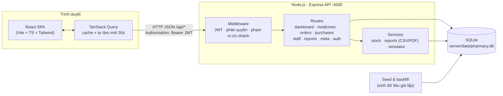
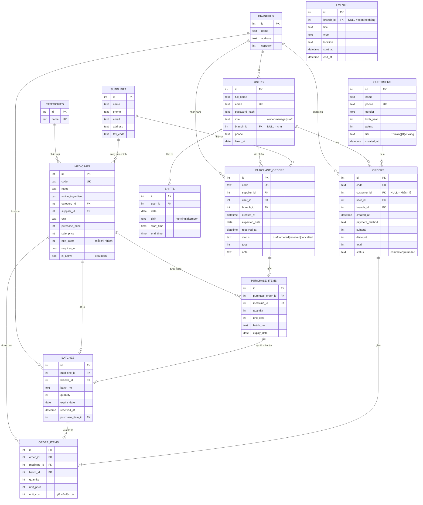
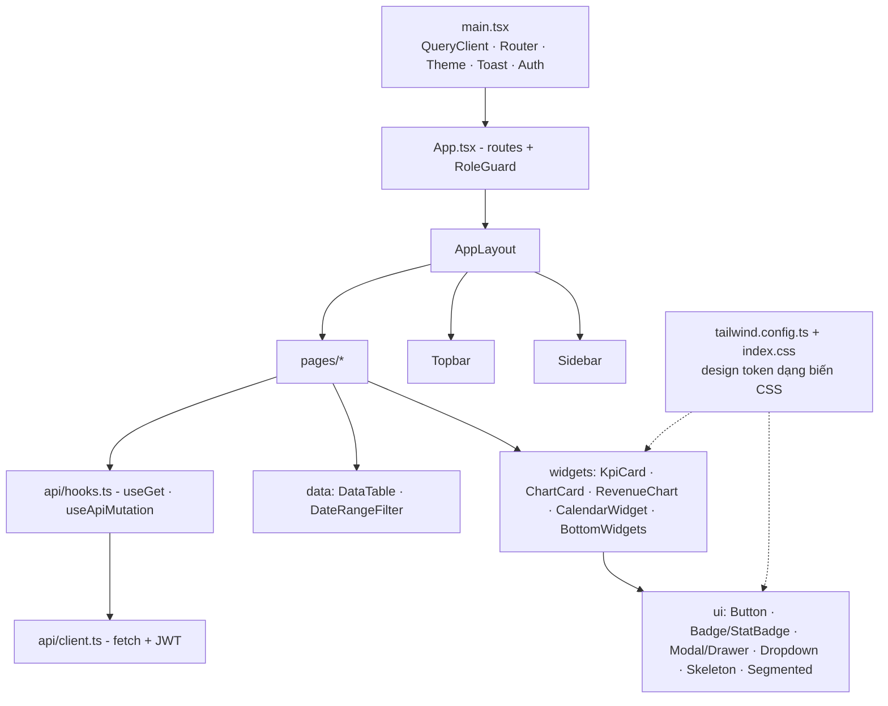

# 4. Thiết kế CSDL và kiến trúc hệ thống

## 4.1 Kiến trúc tổng thể



- **Mô hình:** client–server 3 lớp (giao diện, API, CSDL). Ở chế độ phát triển, Vite proxy `/api` sang cổng 4000. Ở production, Express phục vụ luôn file tĩnh `client/dist`.
- **Phân quyền:** `requireAuth` giải mã JWT; `requireRole` chặn chức năng theo vai trò; `scopeOf(req)` trả về phạm vi dữ liệu (chi nhánh, id nhân viên), và mọi truy vấn đều lọc theo phạm vi này. Giao diện ẩn menu theo vai trò chỉ để tiện dùng, không thay cho kiểm tra ở server.
- **"Thời gian thực":** client tự gọi lại API mỗi 30 giây. Khi khởi động, server bù dữ liệu còn thiếu; chế độ demo sinh đơn mới mỗi 15 giây.

### Luồng xử lý một request (ví dụ: KPI dashboard)

```mermaid
sequenceDiagram
  participant U as Người dùng
  participant C as React (KpiCard)
  participant A as Express API
  participant D as SQLite
  U->>C: Chọn kỳ "7 ngày"
  C->>A: GET /api/dashboard/kpis?range=week&branch=1 (JWT)
  A->>A: requireAuth → scopeOf (chủ: branch=1; nhân viên: user_id)
  A->>D: SUM(total), COUNT(*) kỳ này và kỳ trước
  D-->>A: kết quả
  A-->>C: { revenue: {value, change}, orders, profit|null, expiring }
  C-->>U: Thẻ KPI + huy hiệu % tăng/giảm
```

## 4.2 Sơ đồ ERD



### Các quyết định thiết kế chính

| Quyết định | Lý do |
|---|---|
| Tồn kho quản lý theo **lô** (`batches`) thay vì một cột `stock` | Mỗi lô có hạn dùng riêng, nên mới cảnh báo hết hạn 30/60/90 ngày chính xác được; phù hợp nguyên tắc GPP (nhập trước – hết hạn trước) |
| `order_items.unit_cost` lưu giá vốn tại thời điểm bán | Lợi nhuận lịch sử không bị sai khi giá nhập thay đổi |
| Tiền lưu dạng số nguyên (VND) | Tránh sai số dấu phẩy động |
| Ngày giờ lưu chuỗi giờ địa phương `YYYY-MM-DD HH:MM:SS` | So sánh và nhóm theo chuỗi đơn giản (`substr`), dễ đọc khi debug |
| Xóa thuốc = xóa mềm (`is_active = 0`) | Giữ nguyên lịch sử bán hàng và báo cáo |
| `min_stock` định nghĩa theo 1 chi nhánh | Khi xem "tất cả chi nhánh", hệ thống nhân với số chi nhánh |
| Lịch làm việc tổng hợp từ nhiều bảng | Lịch giao hàng (`purchase_orders`), hạn dùng (`batches`), ca làm (`shifts`); `events` chỉ chứa sự kiện nhập tay |

## 4.3 Danh sách API

Tất cả endpoint có tiền tố `/api` và cần JWT (trừ `auth/login`, `health`). Chủ nhà thuốc có thể thêm `?branch=<id>` để lọc theo chi nhánh.

| Nhóm | Endpoint | Quyền |
|---|---|---|
| Auth | `POST /auth/login`, `GET /auth/me` | Tất cả |
| Meta | `GET /meta/branches`, `/meta/categories`, `/meta/sidebar`, `/meta/search?q=`, `/meta/notifications`, `/meta/last-update` | Tất cả |
| Tổng quan | `GET /dashboard/kpis?range=day\|week\|month` | Tất cả (NV: số của mình, không có lợi nhuận) |
| | `GET /dashboard/revenue?range=1d\|1w\|1m\|6m\|1y\|all` | Tất cả |
| | `GET /dashboard/top-medicines?limit=` | Tất cả |
| | `GET /dashboard/category-revenue`, `GET /dashboard/retention` | Chủ, QL |
| Kho | `GET /medicines?q=&category=&status=&rx=&sort=&page=` · `GET /medicines/:id` | Tất cả (NV không thấy giá nhập) |
| | `POST /medicines` · `PUT /medicines/:id` · `DELETE /medicines/:id` · `POST /medicines/import` | Chủ, QL |
| | `GET /inventory/alerts?type=expiring&days=30\|60\|90` · `?type=low` · `GET /inventory/alert-summary` | Tất cả |
| Đơn hàng | `GET /orders?from=&to=&staff=&payment=&status=&customer=&q=&page=` · `GET /orders/:id` · `GET /orders-filters/staff` | Tất cả (NV: đơn của mình) |
| Khách hàng | `GET /customers?q=&tier=&sort=` · `GET /customers/:id` | Tất cả |
| Nhập hàng | `GET /purchases` · `GET /purchases/:id` · `POST /purchases` · `PATCH /purchases/:id/status` · `PATCH /purchases/:id/receive` | Chủ, QL |
| NCC | `GET /suppliers` · `POST /suppliers` · `PUT /suppliers/:id` | Chủ, QL |
| Nhân viên | `GET /staff?range=` · `GET /staff/shifts?week=YYYY-MM-DD` | Chủ, QL |
| Lịch | `GET /calendar?month=YYYY-MM` · `GET /calendar/day?date=` | Tất cả |
| Báo cáo | `GET /reports/revenue`, `/reports/revenue.csv`, `/reports/revenue.pdf` (`?from=&to=`) · `GET /reports/inventory(.csv\|.pdf)` | Chủ, QL |
| Demo | `GET /demo` · `POST /demo {enabled}` | Xem: tất cả · Bật/tắt: Chủ, QL |

## 4.4 Kiến trúc frontend



- **Design token:** màu định nghĩa bằng biến CSS `--primary`, `--surface`, `--ink`… (dạng `R G B`); Tailwind tham chiếu các biến này, nên dark mode chỉ cần đổi giá trị biến dưới class `.dark`.
- **Biểu đồ:** thang tím 4 bậc (`--chart-1..4`) đã kiểm tra độ tương phản trên nền sáng và tối; mỗi biểu đồ có tooltip, trục Y dùng mốc tròn, và biểu đồ doanh thu có chế độ xem dạng bảng.
